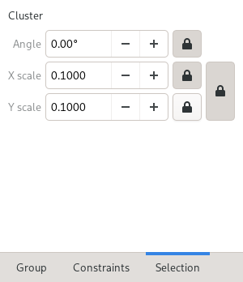

Cluster entities
================

A cluster entity groups multiple in-workplane entities (lines, bezier, 
arcs, circles) into a single entity that can be scaled and rotated. 
Cluster entities are so-called since the term :doc:`Group<groups>` is 
already used for other purposes.
While arcs and circles are supported in in cluster entities, they won't 
get scaled for generating the solid model.

The intended use for cluster entities is making use of logos and and 
artwork imported from DXF files. After importing a logo from a DXF, the 
sketch ends up with lots of entities that are rarely at the right scale
and even more degrees of freedom that slow down the solver. 

Creating clusters
-----------------

The import DXF tool leaves the imported entities selected, so they can 
be be converted to a cluster with the "Create cluster" tool. Creating a 
cluster removes the selected entities and referenced constraints from 
the current sketch. The tool only considers entities from the current 
group that are in the active workplane. Constraints referenced by the 
entities moved into the cluster as well.

Once created, a cluster entity can be scaled and rotated in two ways: 
Select it and lock the to-be set property in the Selection tab.

Another way is adding anchors to the cluster with the "Add cluster 
anchor" tool and constraining the anchors to set scale and rotation.

Modifying clusters
------------------

Once created, the content of clusters can be modified using the 
"Explode Cluster" tool. This will create a new group containing the 
entities and constraints from the cluster. Once done editing, use the 
"Unexplode cluster" tool to update the cluster entity.

