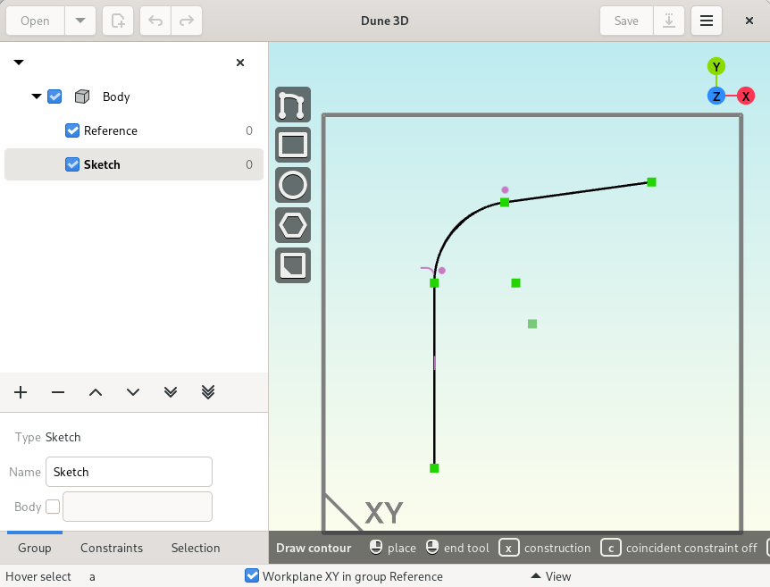
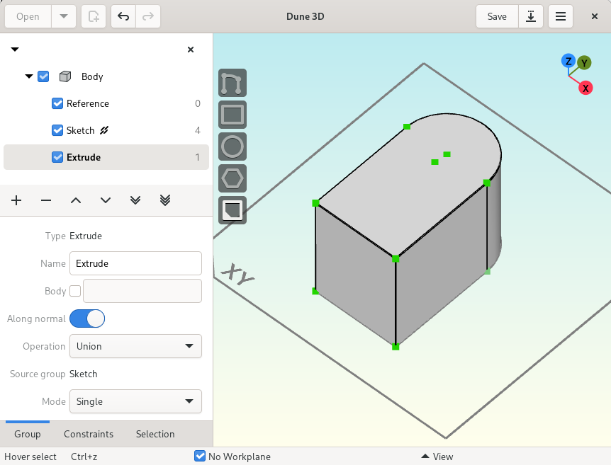
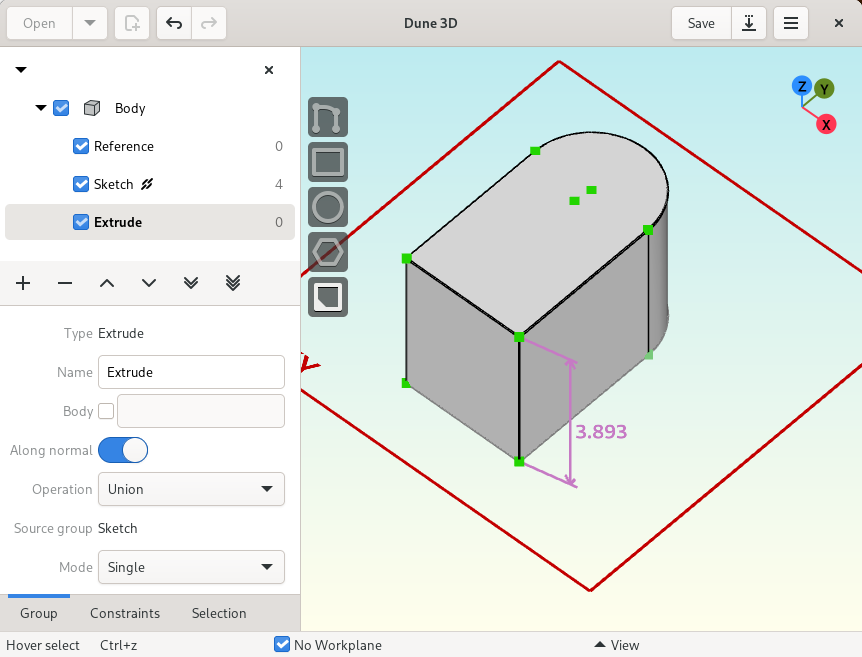
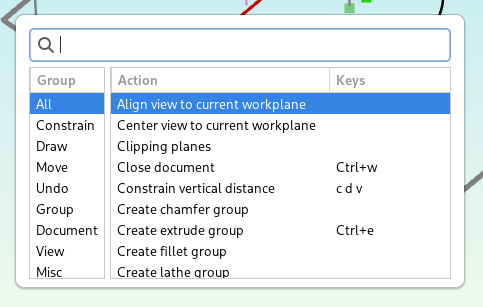
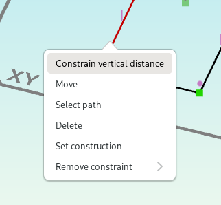
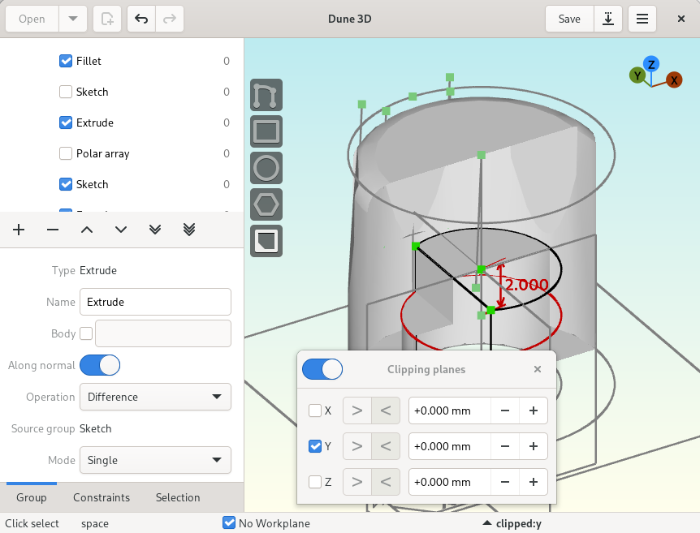
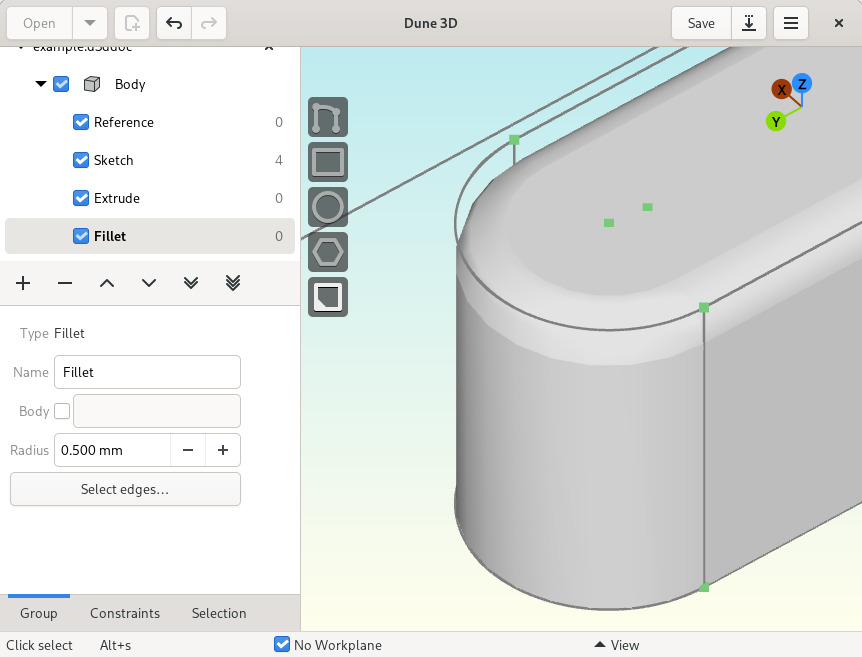
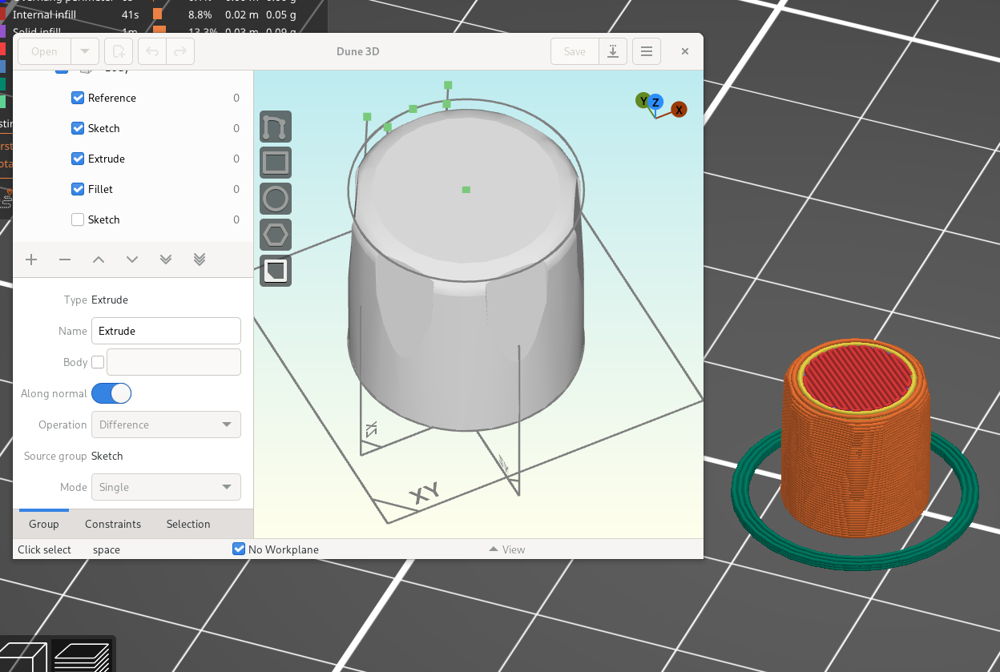

Feature overview
=======================================

Sketch and constrain in 2D
--------------------------

Start your design by drawing lines, arcs and circles using the 
versatile draw contour tool.

Pick from over 20 constraints to best express your design intent.

Make it 3D with extrusion or lathe groups
---------------------------------------------

Use and reuse sketches made in 2D to create 3D objects using extrusion 
or lathe groups.

Use constraints in 3D
---------------------

Use constraints in 3D to define the length and direction of extrusions.

Loves beginners and power users alike
-------------------------------------

Just press the spacebar and get a list of all the actions you can perform. These actions can be bound to customizible single key shortcuts or to vim-like multi key sequences.

The smart context menu only shows tools and actions relevant to the current selection.

Clipping planes
---------------

Clipping planes allow you to look inside the model.

Import STEP models
------------------

Import STEP models to reference printed circuit boards and 
off-the-shelf hardware in your document. 

.. image:: images/step-import.png

Apply fillets and chamfers
--------------------------

Make your models more pretty by applying fillets and chamfers to edges.

Export
------

When your design is done, export it as STL or STEP.

2D export options are available as well.

Versatile input device support
-------------------------------

With Dune 3D, you can make best use of modern laptop's pointing 
devices. Apart from pixel-precision zooming and panning using 
touchpads or trackpoints, you can use
touchscreen gestures such as pinch-to-zoom.
