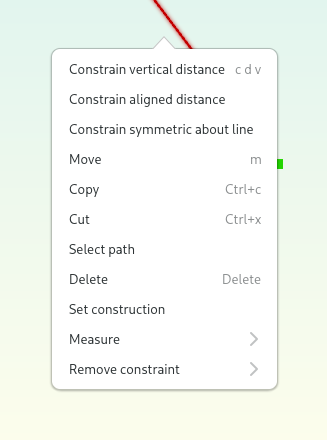

Feature overview
=======================================

Already using Dune 3D? See :doc:`whats-new` for new features in the
latest release.

Sketch and constrain in 2D
--------------------------

Start your design by drawing lines, arcs and circles using the 
versatile draw contour tool.

.. image:: images/sketch.png

Pick from over 20 constraints to best express your design intent. Reuse 
entities and constraints from other sketches and documents with copy 
and paste.

Make it 3D
----------

Use and reuse sketches made in 2D to create 3D objects using extrusion 
or lathe groups.

.. image:: images/extrude.png

Revolution and loft groups are supported as well.

Use constraints in 3D
---------------------

Use constraints in 3D to define the length and direction of extrusions.

.. image:: images/constrain-3d.png

Take measurements
-----------------

All distance and angular constraints can also be used for measurements.

Loves beginners and power users alike
-------------------------------------

Just press the spacebar and get a list of all the actions you can perform. These actions can be bound to customizible single key shortcuts or to vim-like multi key sequences.

.. image:: images/menu.png

The smart context menu only shows tools and actions relevant to the current selection.

Clipping planes
---------------

Clipping planes allow you to look inside the model.

.. image:: images/clipping-planes.png

Workspace views
---------------

Use :doc:`workspace-views` to quickly switch between different views of all 
open documents.

Colored bodies
--------------

Assign individual colors to bodies to make them easier to tell apart in 
complex documents.

Import STEP models
------------------

Import STEP models to reference printed circuit boards and 
off-the-shelf hardware in your document. 

.. image:: images/step-import.png

Imported STEP models can also be integrated into the solid model for 
modification.

Import DXF files
----------------

Quickly get existing geometry into Dune 3D by importing DXF files. Use 
:doc:`cluster` to scale and rotate an imported DXF file as a single 
entity. This is especially useful for logos and such.

Render text
-----------

Dune 3D can render high-quality text making use of OpenType features 
such as tabular figures and kerning.

Apply fillets and chamfers
--------------------------

Make your models more pretty by applying fillets and chamfers to edges.

.. image:: images/fillet.png

Export
------

When your design is done, export it as STL or STEP.

.. image:: images/export.png

2D export options are available as well.

Versatile input device support
-------------------------------

With Dune 3D, you can make best use of modern laptop's pointing 
devices. Apart from pixel-precision zooming and panning using 
touchpads or trackpoints, you can use
touchscreen gestures such as pinch-to-zoom.

3D input devices are supported via `libspnav <https://spacenav.sourceforge.net/>`_.
