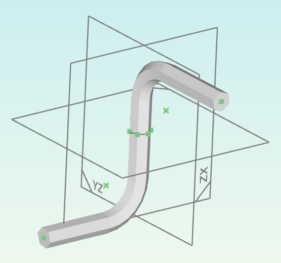

Groups and bodies
=================

A document consists of an ordered list groups. Each group contains
entities and constraints that result in a set of equations that gets 
solved. Groups are solved in the order they're in the document. Once a 
group is solved, the position of its entities can't be modified by 
subsequent groups.

Groups can optionally have an active workplane. It can be in the same 
or any previous group. Use the "Set workplane" and "Clear workplane" 
tools to change the active workplane. With an active workplane, it 
becomes possible to draw entities in 2D space in that workplane.

Groups can be reordered with the restriction that a group and its 
entities and constraints must only reference the group itself or previous groups.

Deleting a group will also delete all dependent groups and entities.

Bodies break up the solid model, in the way that the first group in a 
new body isn't aware of the solid model of the preceding body. Bodies 
have no effect on entities and constraints and can be created and 
removed without adverse effects. That way, bodies are useful to create 
parts consisting of multiple sub-parts such a box with a lid. To add a 
body, select the checkbox next to "Body" in the Group tab.

Bodies can optionally have a solid model color assigned to them. By 
default, it is set by the color theme. To make it easier to tell bodies 
apart, their solid model color can be overridden. To do so, select the 
checkbox next to the color button in the first group of the body or use 
the context menu of the body's row in the workspace browser. The solid 
model color is saved in the document and not part of the workspace view 
state unlike he solid model visibility.

Reference
---------

A reference group is the first group in any document. It automatically contains three 
workplanes, one for each axis. Neither the group nor its workplanes can 
be deleted. Reference groups can't be added explicitly.

It's possible to add entities in the reference group, but not 
recommended.

Sketch
------

A sketch group is meant for adding entities either in a set workplane 
or in 3D. 

The solid model operation of a sketch group applies to STEP model 
entities that are part of the solid model.

Extrude
-------

An extrusion group extrudes closed paths from the source group's active 
workplane along the extrusion vector. When creating an extrusion group, 
the current group and its workplane become the source of the extrusion 
group. The workplane reference is stored in the extrusion group, so 
changing the active workplane of the source group has no effect. To 
create an extrusion group, the current group must have an active 
workplane.

If the "along normal" switch is on, the extrusion vector is along the 
source workplane's normal and the group has one degree of freedom 
instead of three.

Setting the mode to offset adds one extra degree of freedom to change the 
start of the extrusion to an arbitrary point along the extrusion 
vector.

If there is no preceding solid model in the current body, the operation 
(union or difference) has no effect.

It's possible and supported to create multiple disjoint solids in one 
extrusion group.

Lathe
-----

A lathe group rotates closed paths from the source group's active 
workplane along a specified point and vector. To specify it,
either a line or a workplane must be selected when creating the group. 
If a workplane is selected, lathe group is based on its normal vector.

A lathe group adds no degrees of freedom.

Operation has the the same semantics as in extrusion groups.

Revolve
-------

Similar to a lathe group, a revolve group also rotates closed paths 
from the source group along a specified point and vector. It differs 
from a lathe group in the way that it only sweeps the paths by a 
variable angle. It thus adds one degree of freedom. Setting the mode to 
Offset makes the start angle another degree of freedom.

Since version 1.2

Loft
----

A loft group creates a solid by interpolating between two or more 
sketches. It adds no degrees of freedom and requires each source group 
to contain exactly one closed path.

Since version 1.2

Linear array
------------

A linear array group replicates entities from its source group as often 
as specified in "Count" along a vector. Its detailed operation depends 
on whether it has an active workplane or not.

If it has an active workplane, the vector is in that workplane so it adds two degrees of freedom.
Entities from the source group in the same workplane will be copied, as 
well as entities in 3D space. Entities in other workplanes won't be 
copied.

If it has no active workplane, the vector is in 3D space so it adds 
three degrees of freedom. Only entities in 3D space will be copied from 
the source group.

Setting the offset to "original" places the first copy at the same 
location as the entities from the source group.

Setting the offset to "first copy" places the first copy one vector 
away from the original.

Setting the offset to "arbitrary" places the first copy at an arbitrary 
point, adding two or three degrees of freedom.

If the source group has a solid model, its operation is repeated for 
each instance of the array.

Polar array
-----------

A polar array group replicates entities from its source group as often 
as specified in "Count" in circular fashion centered around a point. A 
polar array group always requires a workplane to specify the plane of 
rotation. To create a polar array group, select a workplane first.

By default, it adds three degrees of freedom: Two for the center point 
position, one for the angular increment.

The offset and handling of the solid model work just like in the linear 
array group.

Fillet / Chamfer
----------------

Unlike the other groups, these only operate on the body's solid model 
and don't create any entities. Use the "select edges" tool to select 
the edges the fillet/chamfer is applied to.

Unlike everywhere else, these edges are references to features in the 
solid model and thus are subject to the topological naming problem. 
Therefore, it's recommended to apply these operations as the last step 
in the document's modelling sequence.

.. warning::
  Chamfers and Fillets created with version 1.1 or earlier
  (`this commit <https://github.com/dune3d/dune3d/commit/3b1cb48f9bd2044595d1fa3c71f633ea59bb49f9>`_ to be precise)
  may appear on the wrong edge starting with in this version.

Exploded cluster
----------------

This group can only be created from a cluster with the "Explode 
cluster" tool. It contains the entities and constraint from that 
cluster in the cluster's workplane so they can be edited.  To put them 
back into the cluster, use the "Unexplode cluster" tool, also available 
from the group tab.

Since version 1.2

.. _groups-mirror:

Mirror Horizontal / Vertical
----------------------------

A mirror group mirrors entities across the horizontal or vertical axis 
of its workplane. A mirror group therefore must always have an active 
workplane. In-workplane entities will only get mirrored if they're in 
the group's workplane. Entities in 3D space and the solid model will 
get mirrored across a plane defined by the horizontal/vertical axis of 
the workplane and its normal vector.

The "Include source" switch defines whether or not the source entities 
should be present as-is in the mirror group. This is intended to be 
used to make symmetric extrusions and the like.

Since version 1.3

Solid model operation
---------------------

A solid model operation group performs a solid model operation (that is: 
union/difference/intersection) between two solid models of arbitrary 
groups. Unlike all other groups that generate a solid model, it's not 
bound to the standard modeling sequence that only considers the 
previous groups solid model. It's therefore possible to perform 
operations on the solid models from two otherwise independent bodies.

This group adds no entities or degrees of freedom.

Since version 1.3

Clone
-----

A clone group copies all entities from the source group's active 
workplane into its own active workplane. A clone group must therefore 
always have an active workplane. When creating a clone group, 
the current group and its workplane become the source of the clone
group. The workplane reference is stored in the clone group, so 
changing the active workplane of the source group has no effect. To 
create a clone group, the current group must have an active 
workplane.

It's intended use case is reusing paths for extrude groups in another 
place or orientation.

This group adds no degrees of freedom.

Since version 1.3

.. _groups-pipe:

Pipe
----

A pipe group extrudes closed paths from its source group along one or 
more spine entities. The selected spine entities must form a path, i.e. 
have coinciding end points. Supported spine entities are:

 - Line in workplane
 - Arc in workplane
 - Bezier curve in workplane

While all spine entities must be in a workplane, they can still be in 
different workplanes to each other, making it possible to create solid models that 
look like this:

To select spine entities, use the so-called tool or click on the button 
next to Spine in the Group tab.

For proper solid model generation, it can be required to set a start 
point. A start point can be set clicking on a point that's part of a 
spine entity in the "Select spine entities" tool.

This group adds no entities or degrees of freedom.

Since version 1.3
