Designing a simple part
=======================

In this tutorial, we're going to design a simple part consisting of a 
prism with a pocket in it. While the part itself isn't particularly 
useful on its own, this should give a good overview on how to use Dune 
3D.

The final part will look like this:

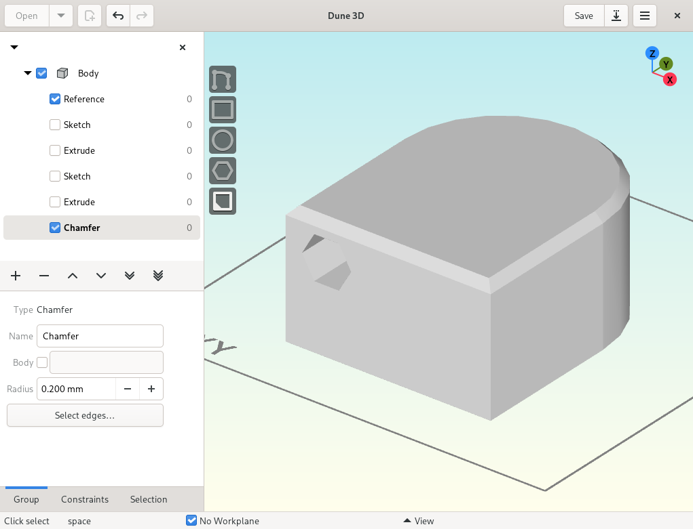

Open a new document
----------------------

Start Dune 3D and create a new document.

Though not strictly required, you can turn off all workplanes but the 
XY one to reduce clutter by switching to the "References" group and 
turning them off.

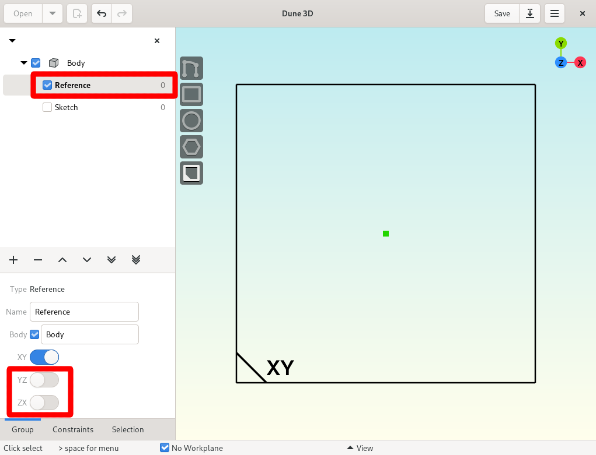

When that's done, remember to switch back to the "Sketch" group.

Sketch
---------

Use the "Draw contour" tool to create a sketch that looks like this:

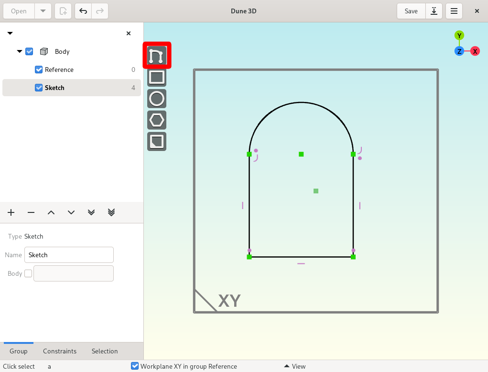

Activate the tool either by

 1. The shortcut :kbd:`d` :kbd:`s`
 2. Opening the menu by pressing :kbd:`Space` and searching for it
 3. The topmost button on the left side of the 3D viewport.
 
In the tool press :kbd:`a` to draw an arc instead of a line. The tool 
automatically constrains almost-vertical/horizontal lines to be 
exactly that and creates coincident constraints when clicking on an 
entity. This and other behaviour can be configured with the shortcuts 
listed in the bar at the bottom of the 3D viewport.

Clicking on the starting point closes the path.

Constrain
------------

In the workspace browser on the left side of the window, we should now 
see that our sketch has 4 degrees of freedom. Our goal now is to get 
this number to zero by adding constraints.

Arc center
^^^^^^^^^^

Constrain the center of the arc to be on the origin of the workplane by 
selecting both points and invoking the "Constrain coincident" tool from
the context menu.

To do so, first press :kbd:`Esc` to clear the selection, then click on 
the arc's center point, followed by the workplane origin. Order doesn't 
matter. Finally, right-click on either of these points to open the 
context menu.

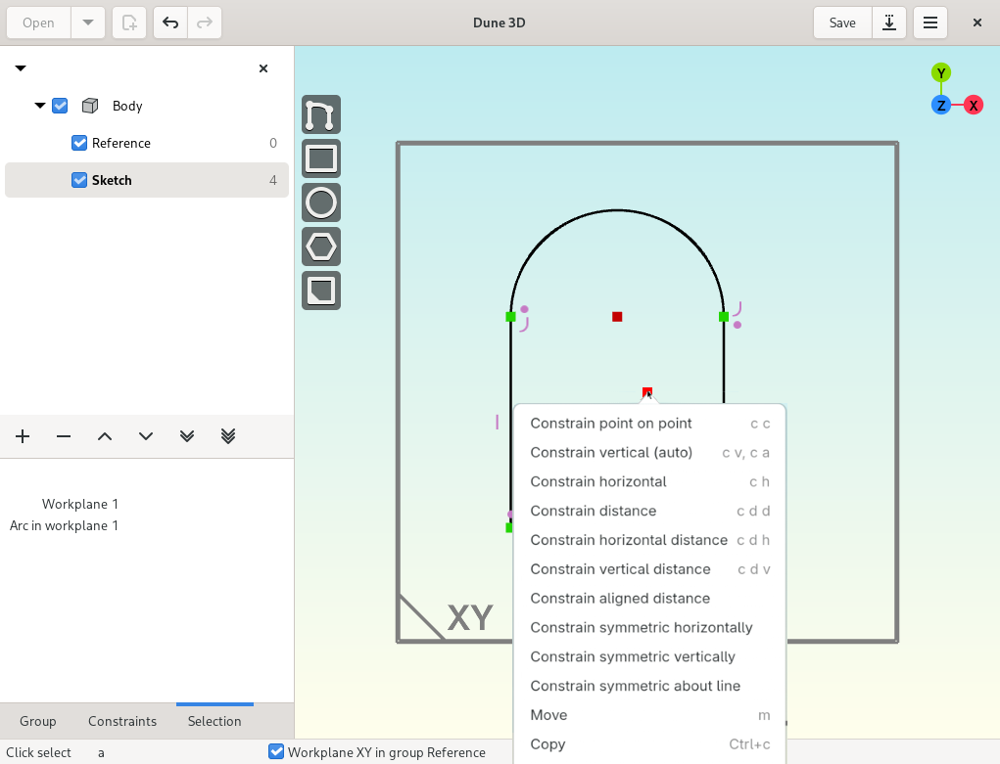

This should have removed two degrees of freedom.

Width
^^^^^

Select the bottom horizontal line and use the "Constrain horizontal 
distance" tool to set its width to 5mm.

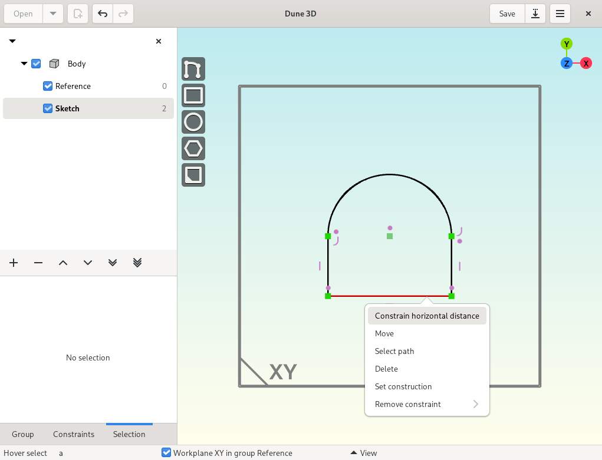

To do so, right-click on it to invoke the constraining tool. Then drag 
the number that appears away from the line to make it easier to read. 
Double-click it to enter the distance.

.. image:: images/tutorial/width-5mm.png

We should now have one degree of freedom.

Height
^^^^^^

We want to constrain the total height of the sketch, but we first need 
to add a point that sits at the top of the arc. 

To to so, use the "Draw point in workplane" tool to place point on the 
arc.

Same as all other tools, this one can be found in the menu by pressing 
:kbd:`Space` and searching for it:

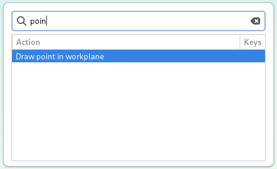

Use the "Constrain vertical" tool to constrain it to be directly 
above the arc's center.

After this, we should still have one degree of freedom.

.. image:: images/tutorial/arc-dot.png

Select the point on the arc and one of the points from the bottom line 
and invoke the "Constrain vertical distance" tool to set the height to 
6mm.

The end result should have zero degrees of freedom and look something 
like this:

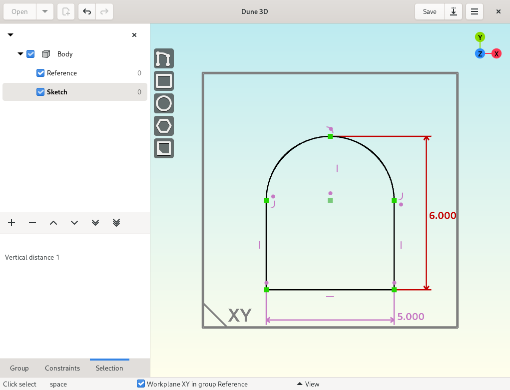

Extrude
-------

With the 2D sketch being fully constrained, we can move on to make it 
3D.

In the workspace browser in the left side of the window, click on the 
plus icon to add an extrusion group. You should now see a grey solid 
appearing. If you can't see it's sides rotate the view by dragging with 
the right mouse button. See :doc:`usage` for how to navigate 
the 3D viewport.

You can change its height by dragging the lines on the top surface.

To set its height, right click on one of the vertical lines and select 
"Constrain distance". If nothing appears, turn off the solid model by 
clicking on the cube next to "Body" in the left side of the window and 
drag the number so that it's outside of the solid model. You may then 
re-enable the solid model and enter a distance value.

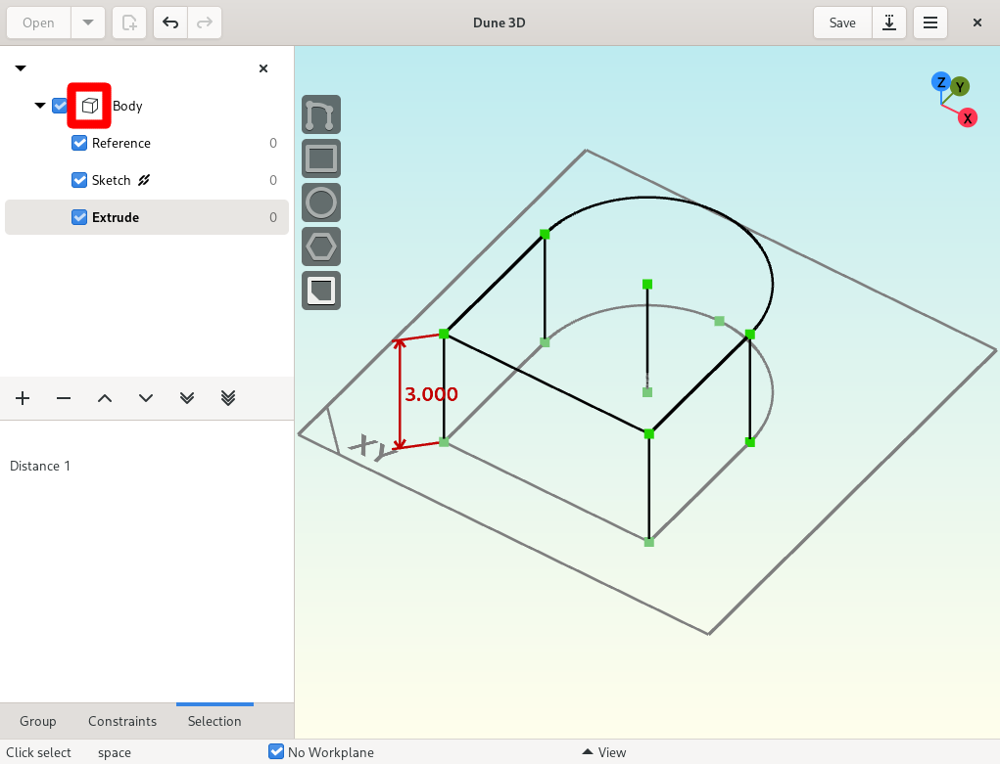

Create workplane
----------------

We now want to place a workplane at the center of the front face so 
that we can use it to create the sketch for the pocket.

First, create a new sketch from the plus icon in the workspace browser. 
Then, use the "Draw Line in 3D" tool to draw a line as shown below. 
We'll use it later to center the workplane on the face.
This is easier to do with the solid model off. Make sure to start and 
end the line from the two corner points so that the point-point 
constraints are created automatically. Watch tool bar the bottom of the 
window and the color of the points to make sure you got them.

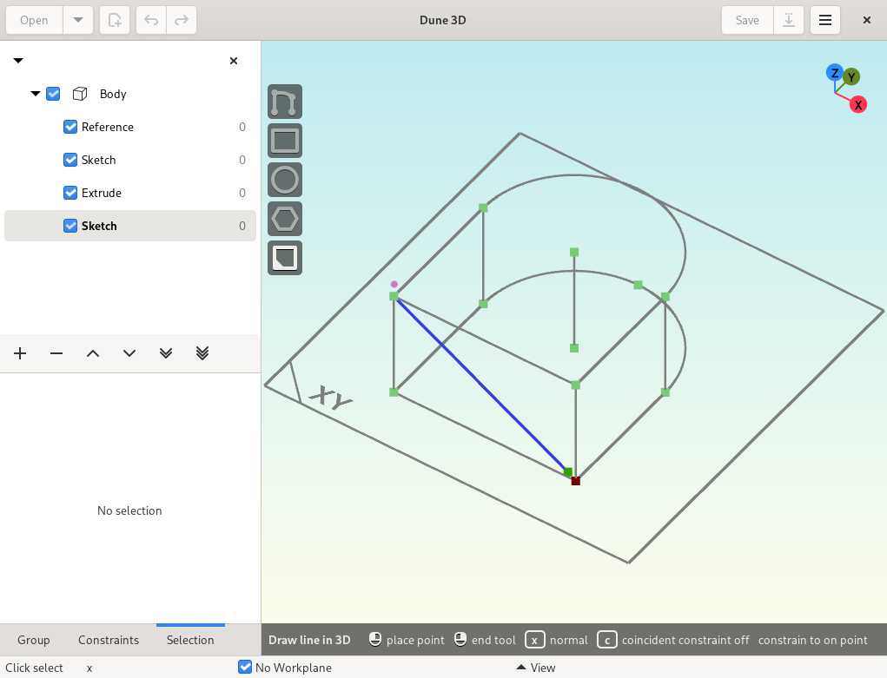

Since we don't need the 
line for anything other than placing the workplane, it can be a 
construction entity. To make it one, press :kbd:`g` while drawing it or 
use "Set construction" from the context menu after the fact.

Next, add the workplane with the "Draw workplane" tool. Clicking on the 
middle of the line will automatically add the midpoint constraint so 
that the workplane sits at the center of the face. Again, watch the 
toolbar to make sure the constraint gets created as needed.

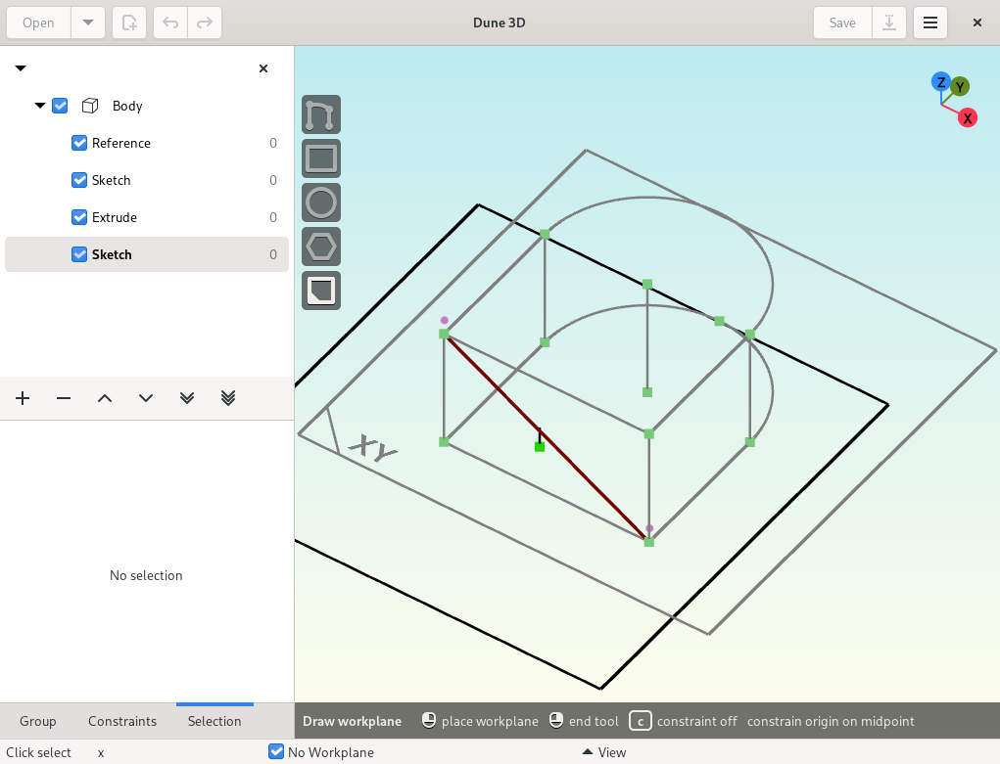

This has constrained the position of the workplane. We still need to 
constrain its 
rotation so that it's in a plane with the face. For that, we're going 
to use the "Constrain workplane normal" tool available from the context 
menu when selecting the newly-created workplane.

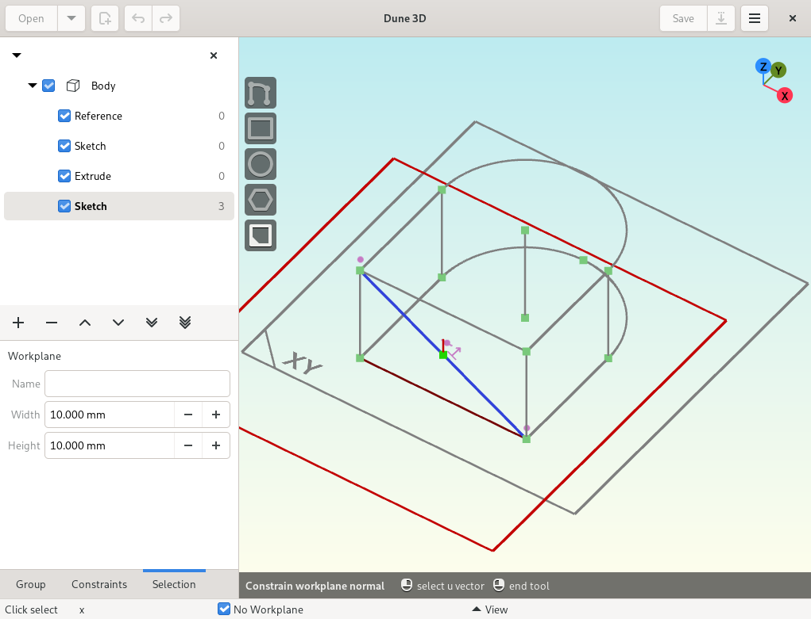

This tool requires you then click on the the line that corresponds to 
the workplane's horizontal direction followed by a second line to 
define the plane. The workplane's normal will then be perpendicular to 
both of the selected lines.

You should now have a workplane that looks like this. Make it this 
sketch's active workplane by selecting "Set workplane" from its context 
menu.

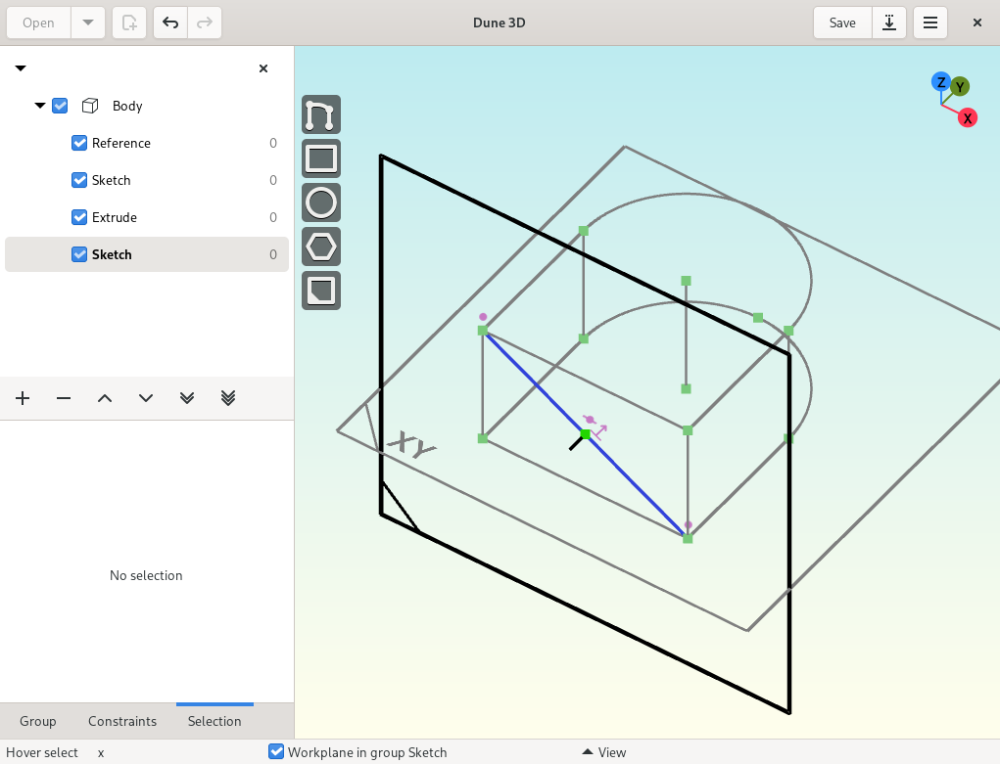

Sketch pocket
-------------

To view the workplane face-on, double-click it or select "Align & 
center view to workplane" from its context menu.

Wit the new workplane in place, we can proceed with the sketch for the 
pocket. Start by drawing a hexagon with the "Draw regular polygon" 
tool.

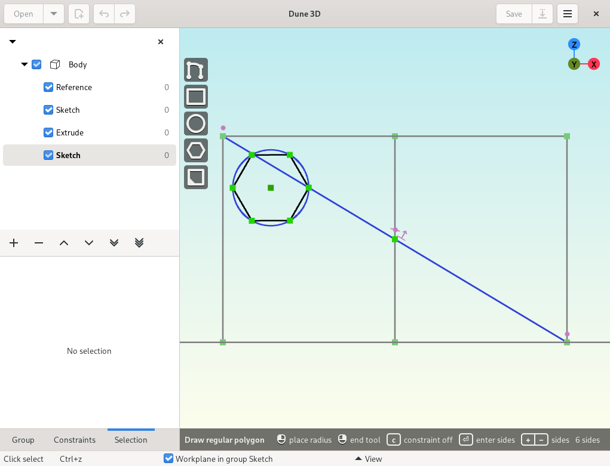

Constrain pocket sketch
-----------------------

To remove all degrees of freedom:

 - Constrain the construction circle's diameter
 - Constrain the bottom line of the hexagon to be horizontal
 - Constrain the horizontal and vertical distance from the top-left 
   point of the face

After these steps, the sketch should look like this:

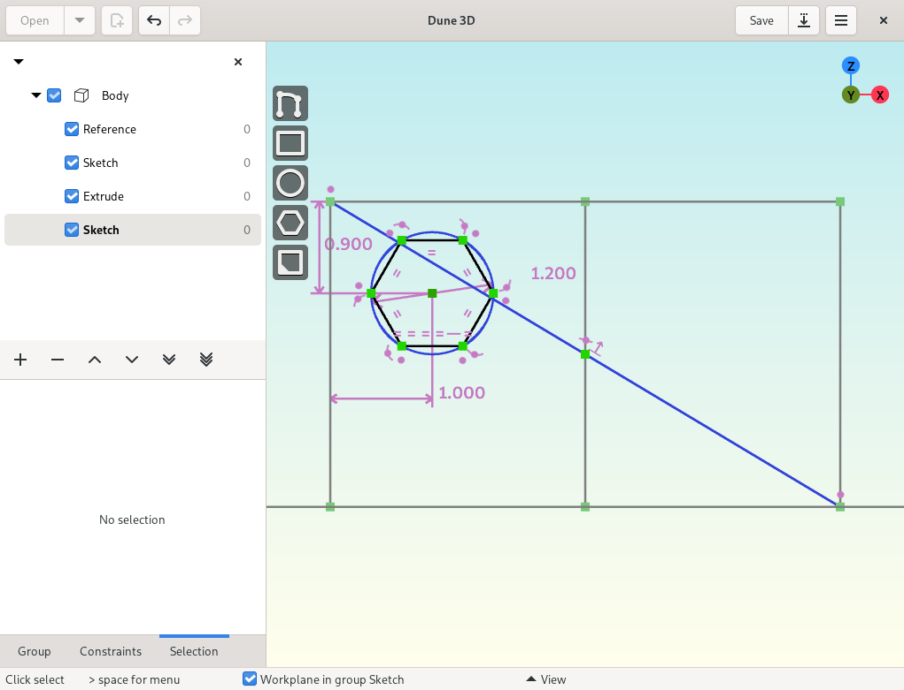

Pocket extrusion
----------------

Create new extrusion, change its operation to difference and drag its 
end inwards so it looks somewhat like this:

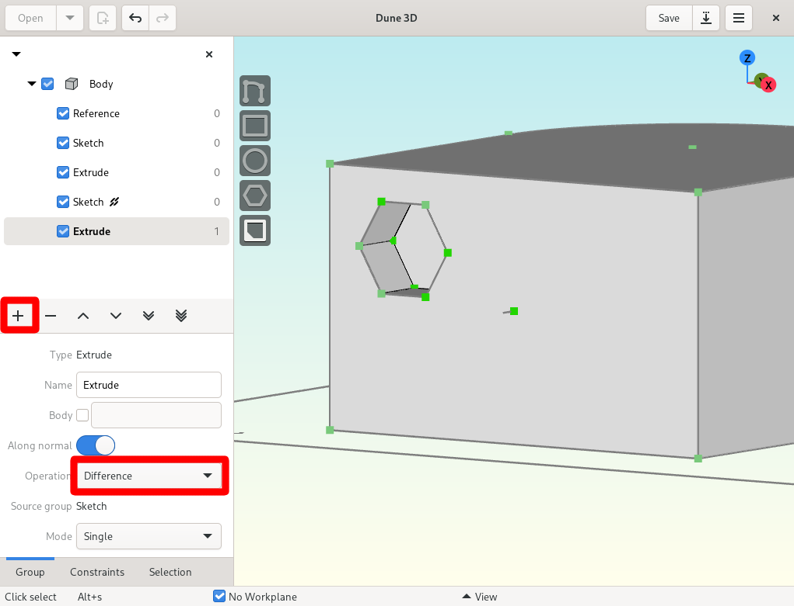

We want the pocket to end 1 mm before the beginning of the semi-circle 
of the outer part. For this, we first need to draw a construction line 
so that we have something that defines the plane. Again, use the "Draw 
Line in 3D" tool for this:

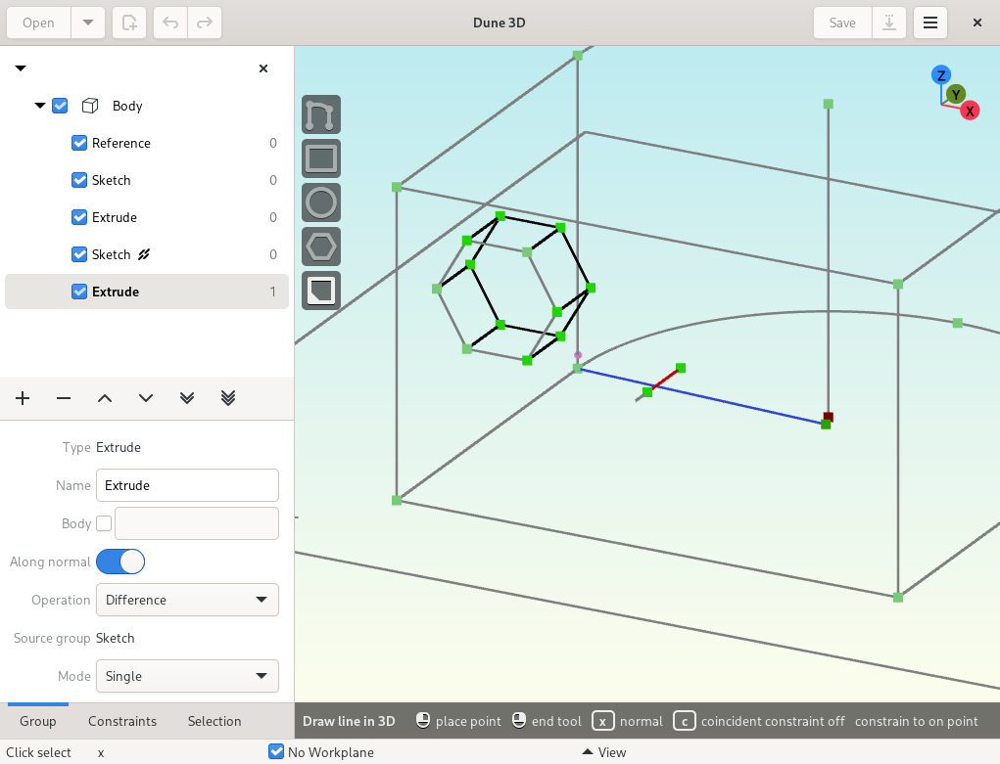

Then, select the newly-created line, one of the other outer lines and 
a point at the tip of the extrusion to invoke the constrain distance 
tool and enter the distance.

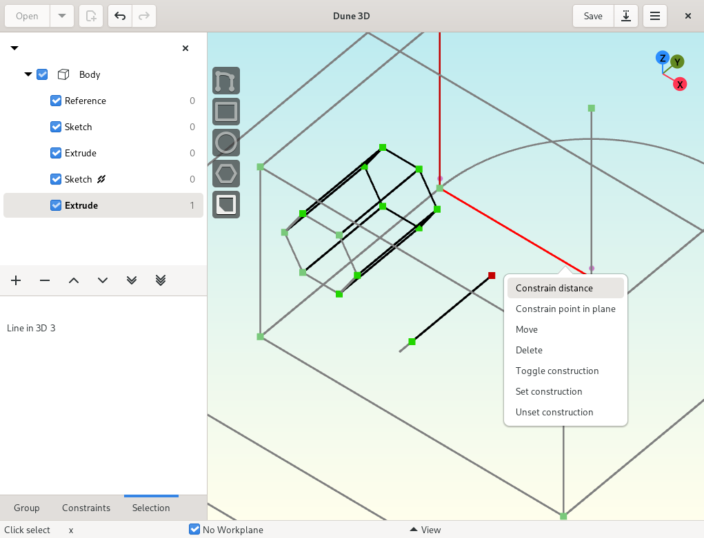

Chamfer
-------

As the last step, we want to add the chamfer on the top surface. For 
this, add a new Chamfer group and click on select edges in the group 
tab. In the select edges tool, select the edges as shown below and 
right-click to confirm the selection.

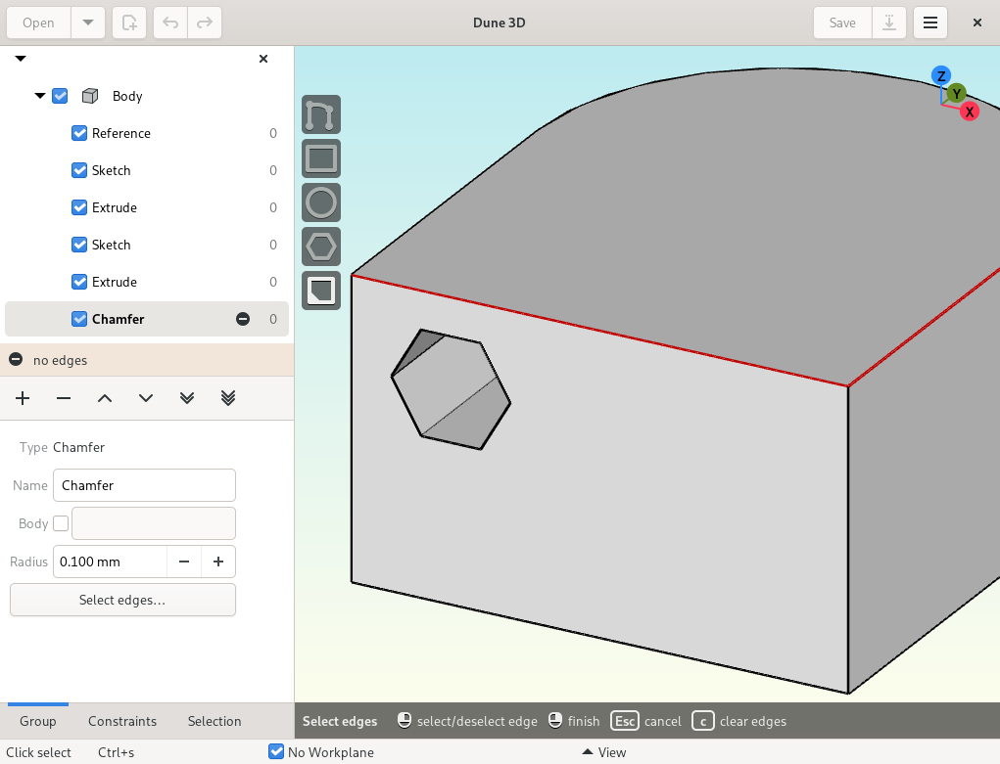

The chamfer group automatically applies the chamfer to tangent edges.

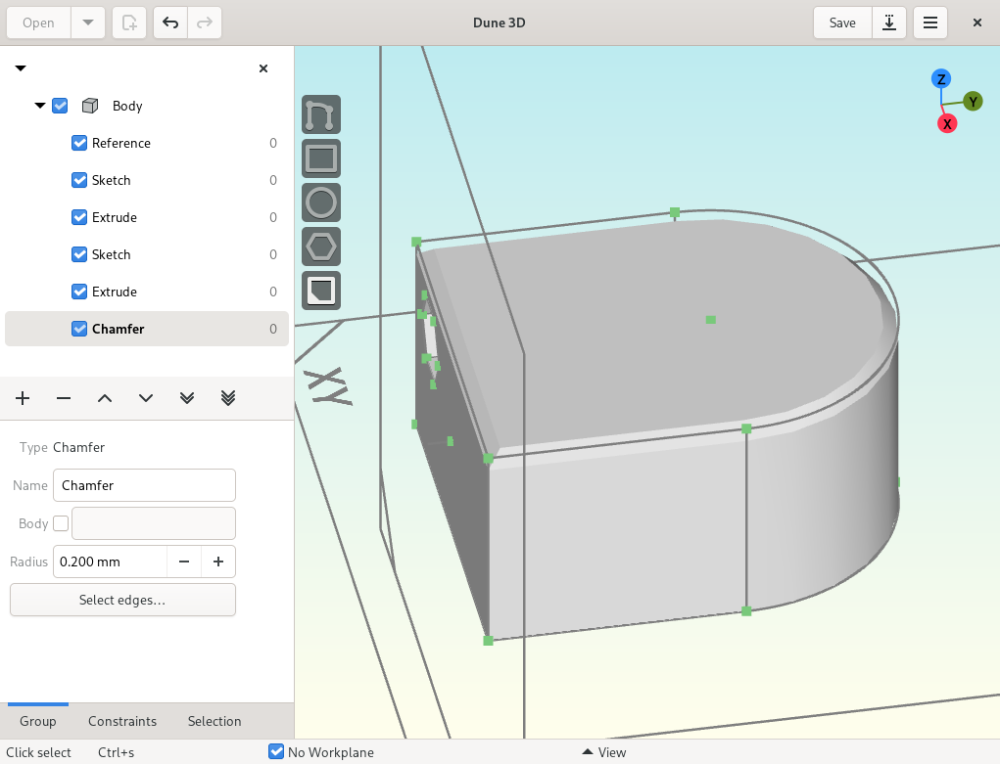

That's it
---------

The part is now done an can be exported as an STL for 3D printing.
