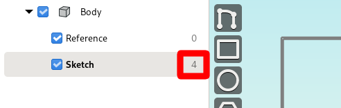
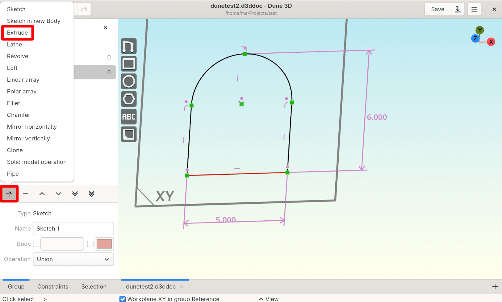
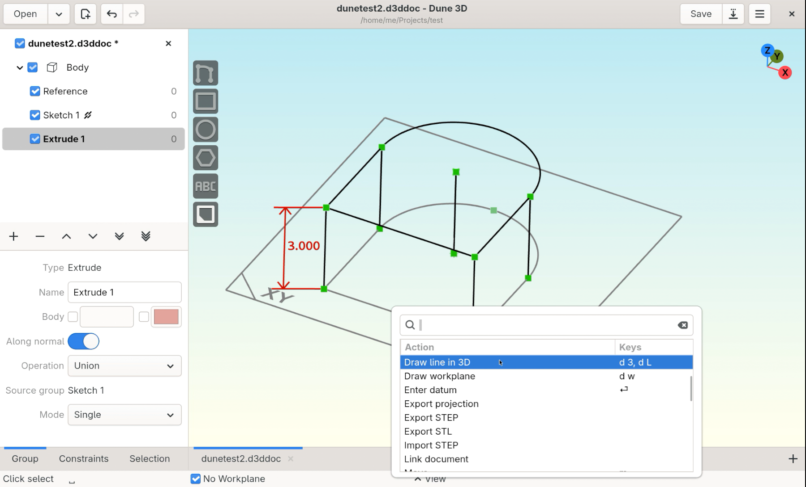
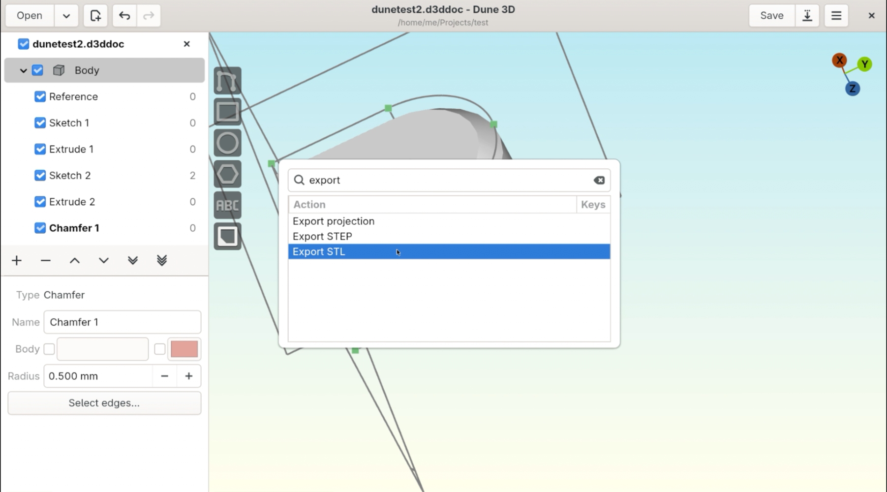

Designing a simple part
=======================

| Let's design a simple part consisting of a prism with a pocket. 
| This should give a good overview on how to use **Dune 3D**.

.. image:: images/tutorial/final.png

Open a new document
----------------------

Start Dune 3D and create a **New Document**.

| For better visibility, turn off all workplanes except the **XY** one 
| by switching to the **"References"** group and turning them **off**.

.. image:: images/tutorial/part-ref-workplanes.png

When done, remember to switch back to the **"Sketch"** group by clicking on **"Sketch1"**.

Sketch
---------

Activate the **"Draw contour"**  tool by either:

- The shortcut :kbd:`d` :kbd:`s`
- Opening the menu by pressing :kbd:`Space` and searching for it
- The topmost button on the left side of the 3D viewport

to create a sketch that looks like this:

.. image:: images/tutorial/sketch.png
 
To draw the **arc**, press :kbd:`a` while the tool is active.

It will automatically constrain almost-vertical/horizontal lines to be 
exact and creates coincident constraints when clicking on an entity. 

This and other behaviour can be configured with the shortcuts 
listed in the bar at the bottom of the 3D viewport:

Finally, **clicking on the starting point** closes the path.

.. note::
 It's best to start from the bottom-left or bottom-right corner so that 
 the arc/line tangential constraints get created automatically. 
 If these didn't get created you can add them by selecting the arc and 
 the line leading up to it and invoking the **"Constrain parallel"** tool.

Constrain
------------

In the workspace browser on the left side, we now see that our sketch has 4 degrees of freedom. 
Our goal now is to get this number to zero by adding **constraints**.

Arc center
^^^^^^^^^^

Constrain the center of the **arc** to be on the origin of the workplane.

| Press :kbd:`Esc` to clear the selection
| Click on the arc's center point, followed by the workplane origin.
| Order doesn't matter.

Right-click on either of these points to open the **context menu** and selecting **"Constrain point on point"**.

.. image:: images/tutorial/constrain-point.png

This should have removed two degrees of freedom.

The added constraint is now visible in your drawing as a violet symbol above the arc's center point:

Width
^^^^^

To set the width to 5mm, right-click onto the horizontal line and to invoke the **constraining tool**.

.. image:: images/tutorial/constrain-horizontal-distance.png

| Drag the appearing number away from the line to make it easier to read. 
| Double-click it to enter the correct distance.

.. image:: images/tutorial/width-5mm.png

Now We should be left with only one degree of freedom.

.. note::
 You can also just select the line and press :kbd:`c` :kbd:`d`  :kbd:`h` 

Height
^^^^^^

| To constrain the total height of the sketch,
| we first need to add a reference point that sits at the top of the arc. 

Press :kbd:`Space` and search for **"Draw point in workplane"**:

.. image:: images/tutorial/point-in-workplane.png

and place the point on the arch.

Then use the **"Constrain vertical"** tool (right-click) to constrain it to be directly above the arc's center.

.. image:: images/tutorial/arc-dot.png

Select the point on the arc and one of the points from the bottom line 
and invoke (right-click)  the **"Constrain vertical distance"** tool to set the height to 6mm.

The end result should have zero degrees of freedom and look like this:

.. image:: images/tutorial/sketch-constrained.png

Extrude
-------

With the 2D sketch being fully constrained, let's make it 3D.

In the **workspace browser**, click the plus (+) icon to add an extrusion group. 

| Now you see a grey 3d solid appearing.
| If you can't see its sides, rotate the view by dragging with the right mouse button.

.. note:: 
 See :doc:`usage` for how to navigate the 3D viewport.

Change its height by dragging the lines on the top surface.

To set its height, right-click on one of the vertical lines and select **"Constrain distance"**.

| If nothing appears, turn off the solid model by clicking on the cube next to **"Body"** in the left side of the window,
| then drag the measurement number until it's outside of the solid model. 

.. image:: images/tutorial/extrude-constrained.png

Create workplane
----------------

Place a workplane at the center of the front face to create the pocket sketch.

Create a new sketch from the plus (+) icon in the **workspace browser**. 

Press :kbd:`Space` and get the **"Draw Line in 3D"** tool to draw a line as shown below.

.. note::
 You can also press :kbd:`d` :kbd:`3` to get the **"Draw Line in 3D"** tool.

This might be is easier in wireframe view (solid model off).

| Draw the line as a **construction entity** by pressing :kbd:`g` 
| or use **"Set construction"** from the **context menu** (right-click) afterwards.

.. note::
 :kbd:`g` toggles between construction and normal line mode.
 
| Make sure to start and end the line from the two corner points so that the point-point constraints are created automatically.
| Watch the **bootom toolbar** and the color of the points to make sure you got them.

.. image:: images/tutorial/draw-diagonal.png

Add the workplane with the **"Draw workplane"** tool. 

Click on **the middle of the drawn 3D line** so it will automatically add the **midpoint constraint** 
so the workplane sits at the center of the face. 

.. image:: images/tutorial/draw-workplane.png

Watch the **bottom toolbar** to make sure the constraint gets created as needed.

We still need to constrain its rotation to be in plane with the face.

Use the **"Constrain workplane normal"** tool available when **right-clicking** the newly created **workplane**.

.. note::
 You can also press :kbd:`c` :kbd:`w` to activate the **"Constrain workplane normal"** tool.

.. image:: images/tutorial/constrain-workplane-normal.png

The **"Constrain workplane normal"** tool requires to click on the the line which corresponds to the workplane's horizontal direction
followed by a second line to define the plane.

The workplane's normal will be perpendicular to both of the selected lines.

.. note::
 If you get the error **"please click on a line from a previous group"** 
 its because the reference lines can not be in the current sketch, you forgot to create new sketch first.

Make it the sketch's active workplane by selecting **"Set workplane"** from its **context menu** (right-click).

.. image:: images/tutorial/workplane-constrained.png

Sketch pocket
-------------

| To view the workplane face-on (2D), double-click it 
| or select **"Align & center view to workplane"** from its **context menu** (right-click).

With the new workplane in place, proceed with the sketch for the pocket.

Start by drawing a hexagon with the **"Draw regular polygon"** tool.

.. note::
 If the line drawing and polygon controls are grayed out, select **"Set Workplane"** in the workplane's context menu (right-click) 
 to make it the active workplane.

.. image:: images/tutorial/draw-regular-polygon.png

Constrain pocket sketch
-----------------------

To remove all degrees of freedom:

 - Constrain the construction circle's diameter
 - Constrain the bottom line of the hexagon to be horizontal
 - Constrain the horizontal and vertical distance from the top-left point of the face

with **selecting corresponding points** and open the  **context menu** (right-click).

The sketch should look like this:

.. image:: images/tutorial/sketch2-constrained.png

Pocket extrusion
----------------

Create new **extrusion** (+), change its operation to **difference** and **drag its end inwards** so it looks like this:

.. image:: images/tutorial/extrude-diff.png

We want the pocket to end 1mm before the beginning of the semi-circle of the outer part.

| Use the **"Draw Line in 3D"** tool :kbd:`d` :kbd:`3`
| make it a **construction line** :kbd:`g`
| and **draw** the construction line so we have a reference.

.. image:: images/tutorial/draw-plane-line.png

| **Select** the newly-created construction line, one of the other outer edge lines and the point at the tip of the extrusion 
| invoke the **constrain distance tool** (right-click) and enter the distance.

.. image:: images/tutorial/constrain-point-plane-distance.png

Chamfer
-------

Add a chamfer on the top surface.

| Add a new Chamfer group (+)
| select all edges which shall have the chamfer
| right-click to confirm 

.. image:: images/tutorial/select-edges.png

.. note::
 The chamfer group automatically applies the chamfer to tangent edges.

.. image:: images/tutorial/chamfer.png

Export
---------

| :kbd:`Space` and type **export**
| select **Export STL** to export a 3d printable file.

| Here ends this tutorial, 
| **Congratulations, you did a great job!**
