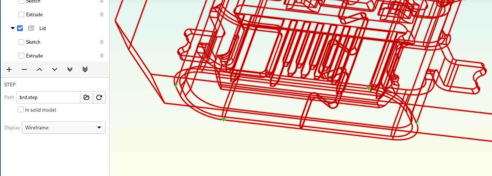

STEP import
===========

Dune 3D supports importing STEP models to reference them in 
user-created entities, for example designing an enclosure to fit around 
a circuit board.

Use the "Import STEP" tool available from the spacebar menu to select a 
STEP file. If the current document is already saved and the STEP file 
is in the same subdirectory as the document, it's filename is stored 
relative to the document. Even after a STEP file is imported, access to 
the original file is still required, so keep this in mind when copying 
documents or sharing them with other people.

In the import tool, you can rotate the imported STEP model by pressing
:kbd:`x`, :kbd:`y` or :kbd:`z`. Rotating the part automatically locks 
the rotational degrees of freedom by applying the "lock rotation" 
constraint. :kbd:`k` toggles this constraint.

The resulting STEP entity has 3 or 6 degrees of freedom: Three translational 
and optionally three rotational DOFs if the rotation wasn't locked in 
the import tool. The lock rotation constraint may be used to 
lock the rotational DOFs to the entered values.

The "Add anchors" tool adds points to reference geometry from the STEP 
model. Once added, points stay where they were placed, ignoring changes 
from the referenced STEP model. Use the "Move anchor" tool to move 
individual anchors to new positions.

The shapes from an imported STEP model can also be made available in 
the solid model of Sketch Groups by selecting "In solid model" in the 
Selection tab. This feature of STEP entities is only available in Sketch
Groups. It's supposed to be useful for customizing an existing 
part, such as adding text to a 3D-printed phone case.

To move anchors that fall inside of the solid after reloading a STEP 
model, it can be shown as a wireframe only:

