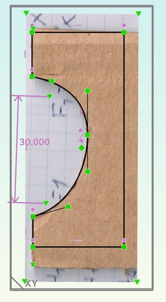
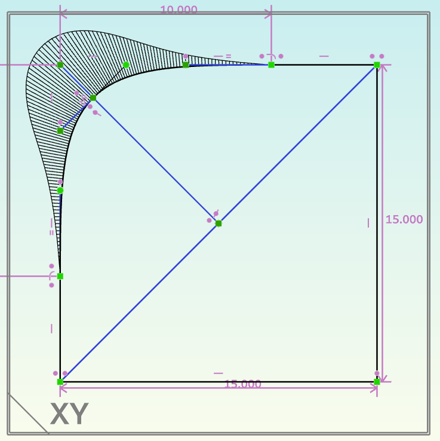
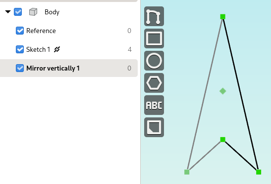
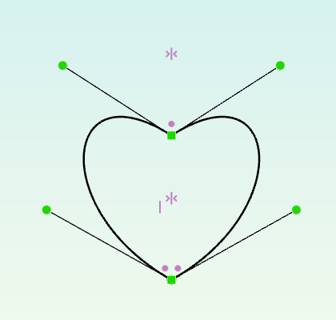
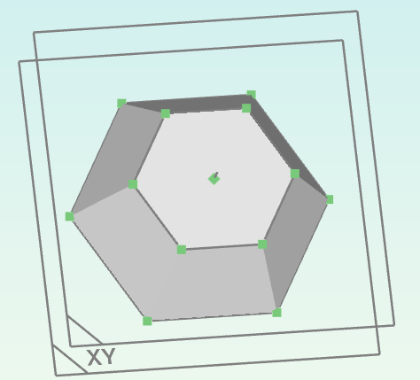
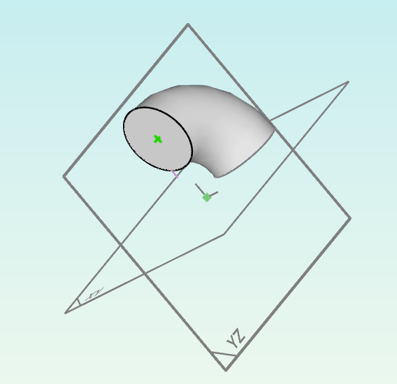
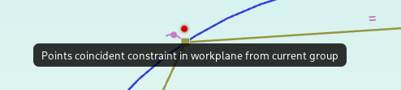
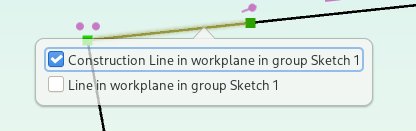

What's new
==========

In Version 1.3
--------------

See `the changelog for version 1.3 <https://github.com/dune3d/dune3d/blob/v1.3.0/CHANGELOG.md#version-130>`_ for a complete list of changes.

Picture import
^^^^^^^^^^^^^^

Import photos or scans to reference in a sketch. By placing anchors, you can
precisely scale the imported picture or reference specific points in constraints.

Where to find it: In a sketch group with an active workplane, search for "Import picture" in the spacebar menu.

Constraint preview
^^^^^^^^^^^^^^^^^^

Hover over constraints in the context or new constrain menu and get an instant preview of what the constraint will
do to your sketch once it's applied.

.. raw:: html

	<video autoplay loop>
	   <source src="_static/constraint-preview.mp4" type="video/mp4">
	</video>

Where to find it: Open the new constrain menu by pressing :kbd:`z` or right-click.

Pipe groups
^^^^^^^^^^^

With :ref:`pipe groups<groups-pipe>`, you can extrude a sketch along a path.

.. image:: images/pipe.png

Where to find it: Click the plus button below the groups list and select "Pipe".

Curvature combs
^^^^^^^^^^^^^^^

Enable curvature combs to tweak bezier curves for super-smooth corners.

Where to find it: In the view options menu in the status bar, increase the curvature comb scale.

Mirror groups
^^^^^^^^^^^^^

Use :ref:`mirror groups<groups-mirror>` to quickly create symmetric objects.

Where to find it: Click the plus button below the groups list and select "Mirror horizontally" or "Mirror vertically".

Selection menu
^^^^^^^^^^^^^^

The selection menu that was previously opened by clicking multiple times
can now be opened by clicking and holding the left mouse button. That way,
the menu also works in tools that allow selecting entities such as when
drawing a line and placing a constraint on an existing point.

In Version 1.2
--------------

See `the changelog for version 1.2 <https://github.com/dune3d/dune3d/blob/v1.2.0/CHANGELOG.md#version-120>`_ for a complete list of changes.

.. warning::
  Chamfers and Fillets created with version 1.1 or earlier
  (`this commit <https://github.com/dune3d/dune3d/commit/3b1cb48f9bd2044595d1fa3c71f633ea59bb49f9>`_ to be precise)
  may appear on the wrong edge starting with in this version.

Copy / Paste
^^^^^^^^^^^^

Use copy/paste to reuse sketches, even across multiple documents.

Where to find it: The usual :kbd:`Ctrl`-:kbd:`C`/:kbd:`X`/:kbd:`V` shortcuts.
See :doc:`Copy / Paste<copy-paste>` for more information.

Bezier curves
^^^^^^^^^^^^^

Easily draw pretty curves using cubic beziers. Constraints for smooth or
symmetric tangents and point-on-bezier are available as well.

Where to find it: In the "Draw Contour" tool, press :kbd:`b` to switch to
bezier mode or use the "Draw bezier curve in workplane" tool.

Body colors
^^^^^^^^^^^

Don't get lost in complex documents by coloring bodies.

.. image:: images/body-colors.png

Where to find it: Right-click on a body in the workspace browser and select
"Set color".

Text entities
^^^^^^^^^^^^^

Add high-quality text to your parts with support for OpenType features such as ligatures
or tabular figures.

.. image:: images/text.png

Where to find it: "Draw Text" tool or the "ABC" button in the action bar.

DXF import and cluster entities
^^^^^^^^^^^^^^^^^^^^^^^^^^^^^^^

Quickly get existing geometry into Dune 3D by importing DXF files. Use 
Cluster Entities to scale and rotate an imported DXF file as a single 
entity. This is especially useful for logos and such.

.. image:: images/dxf.png

Where to find it: "Import DXF" tool, "Create cluster" tool.
See :doc:`cluster` for more information.

Loft groups
^^^^^^^^^^^

Create tapered non-circular solids that'd be difficult to generate otherwise
using loft groups.

Where to find it: In the create group menu (plus icon below the list of groups),
select "Loft".

Revolve groups
^^^^^^^^^^^^^^

In addition to lathe groups that do full 360° rotational sweeps, there now
are revolve groups that do circular sweeps over a variable angle.

Where to find it: In the create group menu (plus icon below the list of groups),
select "Revolve".

Measurements
^^^^^^^^^^^^

All distance and angular constraints can also be used for measurements.

.. image:: images/meas.png

Where to find it: In the context menu, look for the measurement tools.

Workspace views
^^^^^^^^^^^^^^^

Use :doc:`workspace-views` to quickly switch between different views of all 
open documents.

Where to find it: Tab bar at the bottom of the window, click the plus button
on the right edge to add a new workspace view.

Tooltips
^^^^^^^^

Know what you're looking at with handy tooltips.

Where to find it: Keep to mouse cursor over items for a short while.

Improved selection
^^^^^^^^^^^^^^^^^^

When selecting overlapping entities, there now is a menu to select a specific
entity.

Where to find it: Click three times on the overlapping entities or hold :kbd:`Shift` to show
the menu right away.

STEP models as wireframe
^^^^^^^^^^^^^^^^^^^^^^^^

Imported STEP models can now be displayed as a wireframe or hidden to reduce clutter
or move anchors that fell inside of the solid:

.. image:: images/step-wireframe.png

Where to find it: In the "Selection" tab after selecting the STEP model.

In Version 1.1
--------------

See `the changelog for version 1.1 <https://github.com/dune3d/dune3d/blob/v1.1.0/CHANGELOG.md#version-110>`_ for a complete list of changes.
